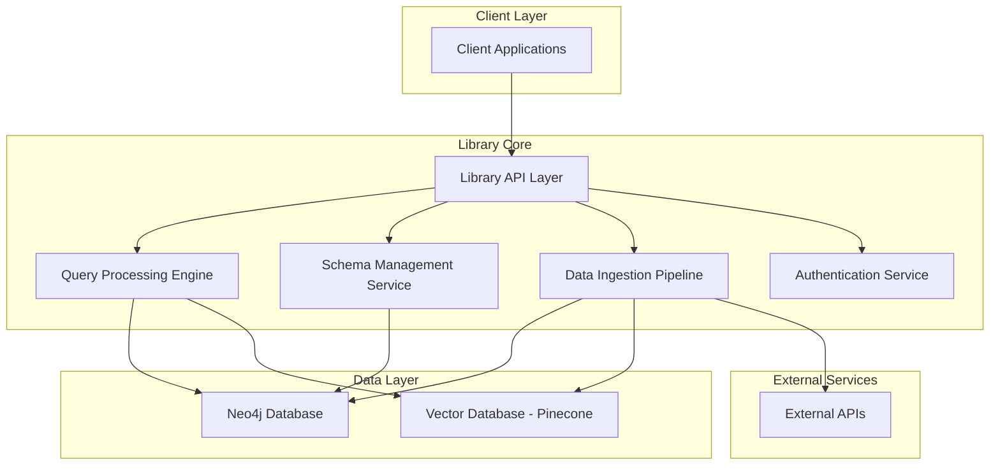
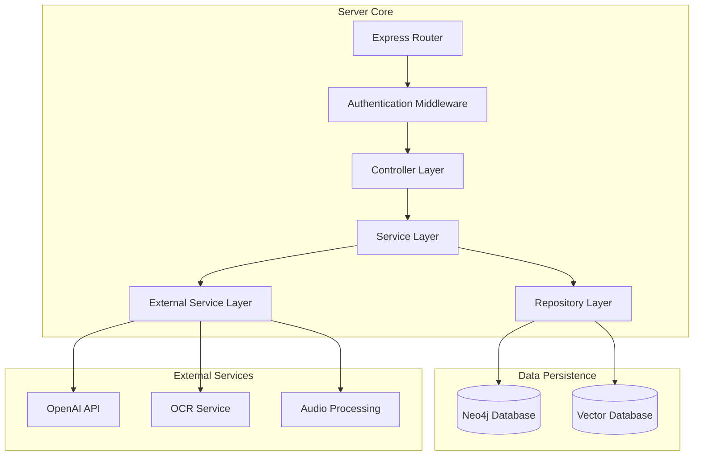
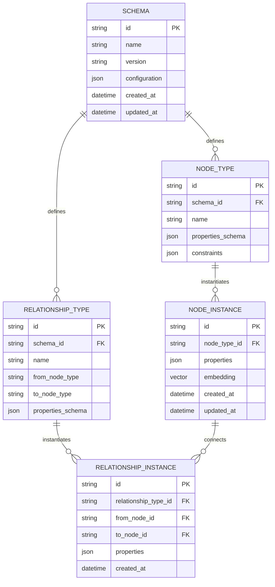

# Neo4j Graph Database Library - Technical Architecture Document

## 1. Architecture Design



## 2. Technology Description

* Frontend: React\@18 + TypeScript + tailwindcss\@3 + vite (for admin dashboard)

* Backend: Node.js\@18 + Express\@4 + TypeScript

* Database: <Neo4j@5.x> + Pinecone (vector embeddings)

* Authentication: JWT + bcrypt

* Additional: OpenAI API, Tesseract.js (OCR), multer (file uploads)

## 3. Route Definitions

| Route              | Purpose                                        |
| ------------------ | ---------------------------------------------- |
| /api/schema        | Schema management operations (CRUD)            |
| /api/database      | Database instance management                   |
| /api/nodes         | Node operations (create, read, update, delete) |
| /api/relationships | Relationship operations                        |
| /api/query         | Natural language and Cypher query execution    |
| /api/search        | Semantic search and retrieval                  |
| /api/ingest        | Data ingestion and processing                  |
| /api/export        | Data export and visualization                  |
| /api/auth          | Authentication and authorization               |
| /dashboard         | Admin dashboard interface                      |

## 4. API Definitions

### 4.1 Core API

**Schema Management**

```
POST /api/schema
```

Request:

| Param Name    | Param Type      | isRequired | Description                       |
| ------------- | --------------- | ---------- | --------------------------------- |
| name          | string          | true       | Schema name identifier            |
| nodeTypes     | NodeType\[]     | true       | Array of node type definitions    |
| relationships | RelationType\[] | true       | Array of relationship definitions |
| constraints   | Constraint\[]   | false      | Schema validation constraints     |

Response:

| Param Name       | Param Type | Description              |
| ---------------- | ---------- | ------------------------ |
| schemaId         | string     | Unique schema identifier |
| status           | string     | Creation status          |
| validationErrors | string\[]  | Any validation issues    |

Example:

```json
{
  "name": "visual_memory_schema",
  "nodeTypes": [
    {
      "name": "Screenshot",
      "properties": {
        "filepath": "string",
        "timestamp": "datetime",
        "ocrText": "string",
        "visualDescription": "string",
        "embedding": "vector"
      }
    }
  ],
  "relationships": [
    {
      "name": "CONTAINS_TEXT",
      "from": "Screenshot",
      "to": "TextElement"
    }
  ]
}
```

**Natural Language Query**

```
POST /api/query/natural
```

Request:

| Param Name | Param Type | isRequired | Description                   |
| ---------- | ---------- | ---------- | ----------------------------- |
| query      | string     | true       | Natural language query        |
| schemaId   | string     | true       | Target schema identifier      |
| limit      | number     | false      | Maximum results (default: 10) |
| filters    | object     | false      | Additional query filters      |

Response:

| Param Name    | Param Type     | Description                |
| ------------- | -------------- | -------------------------- |
| results       | QueryResult\[] | Array of matching results  |
| confidence    | number         | Query confidence score     |
| cypherQuery   | string         | Generated Cypher query     |
| executionTime | number         | Query execution time in ms |

**Data Ingestion**

```
POST /api/ingest
```

Request:

| Param Name        | Param Type | isRequired | Description                             |
| ----------------- | ---------- | ---------- | --------------------------------------- |
| dataType          | string     | true       | Type of data (image, text, audio, code) |
| files             | File\[]    | false      | Files to process                        |
| urls              | string\[]  | false      | URLs to scrape                          |
| schemaId          | string     | true       | Target schema                           |
| processingOptions | object     | false      | Processing configuration                |

Response:

| Param Name     | Param Type | Description               |
| -------------- | ---------- | ------------------------- |
| jobId          | string     | Processing job identifier |
| status         | string     | Processing status         |
| processedCount | number     | Number of items processed |
| errors         | string\[]  | Processing errors         |

## 5. Server Architecture Diagram



## 6. Data Model

### 6.1 Data Model Definition



### 6.2 Data Definition Language

**Schema Management Tables**

```sql
-- Neo4j Schema Nodes
CREATE (s:Schema {
    id: randomUUID(),
    name: $name,
    version: $version,
    configuration: $config,
    created_at: datetime(),
    updated_at: datetime()
});

CREATE INDEX schema_name_idx FOR (s:Schema) ON (s.name);
CREATE INDEX schema_created_idx FOR (s:Schema) ON (s.created_at);

-- Node Type Definitions
CREATE (nt:NodeType {
    id: randomUUID(),
    schema_id: $schema_id,
    name: $name,
    properties_schema: $properties_schema,
    constraints: $constraints,
    created_at: datetime()
});

CREATE INDEX node_type_schema_idx FOR (nt:NodeType) ON (nt.schema_id);
CREATE INDEX node_type_name_idx FOR (nt:NodeType) ON (nt.name);

-- Relationship Type Definitions
CREATE (rt:RelationshipType {
    id: randomUUID(),
    schema_id: $schema_id,
    name: $name,
    from_node_type: $from_type,
    to_node_type: $to_type,
    properties_schema: $properties_schema,
    created_at: datetime()
});

-- Example: Visual Memory Search Schema
CREATE (s:Schema {
    id: 'visual_memory_v1',
    name: 'Visual Memory Search',
    version: '1.0.0',
    configuration: {
        embedding_model: 'text-embedding-ada-002',
        ocr_enabled: true,
        visual_analysis: true
    },
    created_at: datetime(),
    updated_at: datetime()
});

CREATE (screenshot:NodeType {
    id: randomUUID(),
    schema_id: 'visual_memory_v1',
    name: 'Screenshot',
    properties_schema: {
        filepath: 'string',
        timestamp: 'datetime',
        ocr_text: 'string',
        visual_description: 'string',
        embedding: 'vector',
        confidence_score: 'float'
    },
    constraints: ['filepath REQUIRED', 'timestamp REQUIRED']
});

CREATE (text_element:NodeType {
    id: randomUUID(),
    schema_id: 'visual_memory_v1',
    name: 'TextElement',
    properties_schema: {
        content: 'string',
        position: 'object',
        font_info: 'object',
        embedding: 'vector'
    }
});

-- Constraints and Indexes
CREATE CONSTRAINT screenshot_filepath_unique FOR (s:Screenshot) REQUIRE s.filepath IS UNIQUE;
CREATE INDEX screenshot_timestamp_idx FOR (s:Screenshot) ON (s.timestamp);
CREATE INDEX text_element_content_idx FOR (t:TextElement) ON (t.content);
```

**Vector Database Schema (Pinecone)**

```javascript
// Vector index configuration
const vectorIndexConfig = {
  name: 'graph-embeddings',
  dimension: 1536, // OpenAI embedding dimension
  metric: 'cosine',
  metadata_config: {
    indexed: ['node_type', 'schema_id', 'timestamp']
  }
};

// Example vector record
const vectorRecord = {
  id: 'node_uuid',
  values: [0.1, 0.2, ...], // 1536-dimensional embedding
  metadata: {
    node_type: 'Screenshot',
    schema_id: 'visual_memory_v1',
    content_preview: 'error message about auth',
    timestamp: '2024-01-15T10:30:00Z'
  }
};
```

