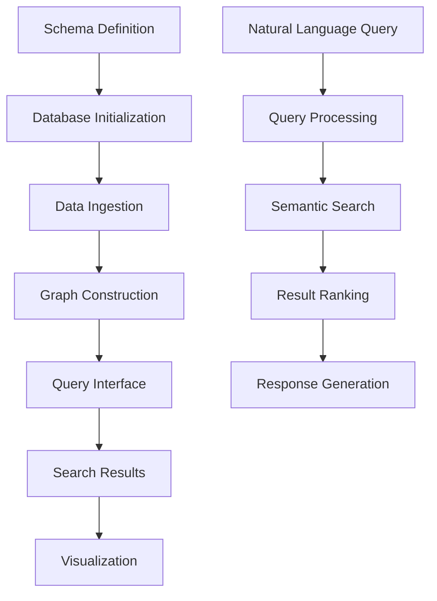

# Neo4j Graph Database Library - Product Requirements Document

## 1. Product Overview
A flexible Neo4j-based graph database library that enables schema-driven database creation and provides comprehensive CRUD, search, and retrieval operations for diverse data types including text, images, audio, code, and documents.

The library serves as a unified backend foundation for multiple AI-powered applications, supporting natural language queries, semantic search, and interactive graph visualization across different domains from visual memory search to knowledge graph construction.

## 2. Core Features

### 2.1 User Roles
| Role | Registration Method | Core Permissions |
|------|---------------------|------------------|
| Developer | API Key authentication | Full access to schema creation, database operations, and configuration |
| Application User | Token-based authentication | Read/write access to specific graph instances based on application context |
| Admin | System-level credentials | Complete system management, monitoring, and multi-tenant configuration |

### 2.2 Feature Module
Our Neo4j graph database library consists of the following main components:
1. **Schema Management Interface**: Dynamic schema definition, validation, and migration tools.
2. **Database Operations Engine**: CRUD operations, batch processing, and transaction management.
3. **Search & Query Interface**: Natural language processing, semantic search, and graph traversal queries.
4. **Data Ingestion Pipeline**: Multi-format data processing, extraction, and graph construction.
5. **Visualization & Export Module**: Graph visualization, data export, and reporting capabilities.
6. **Administration Dashboard**: System monitoring, performance analytics, and configuration management.

### 2.3 Page Details
| Page Name | Module Name | Feature description |
|-----------|-------------|---------------------|
| Schema Management Interface | Schema Designer | Create, modify, and validate graph schemas with node types, relationships, and constraints |
| Schema Management Interface | Migration Manager | Handle schema versioning, backward compatibility, and data migration between schema versions |
| Database Operations Engine | CRUD Controller | Execute create, read, update, delete operations on nodes and relationships with validation |
| Database Operations Engine | Batch Processor | Handle bulk data operations, import/export, and transaction management |
| Search & Query Interface | Natural Language Processor | Parse natural language queries and convert to Cypher queries with context understanding |
| Search & Query Interface | Semantic Search Engine | Perform vector-based similarity search, content matching, and relevance scoring |
| Data Ingestion Pipeline | Multi-format Parser | Process text files, images (OCR), audio transcripts, code repositories, and web content |
| Data Ingestion Pipeline | Graph Constructor | Transform parsed data into graph structures with automatic relationship detection |
| Visualization & Export Module | Graph Renderer | Generate interactive graph visualizations with filtering, clustering, and layout options |
| Visualization & Export Module | Export Manager | Export data in multiple formats (JSON, CSV, GraphML) and generate reports |
| Administration Dashboard | System Monitor | Track performance metrics, query execution times, and resource utilization |
| Administration Dashboard | Configuration Panel | Manage database connections, security settings, and application-specific configurations |

## 3. Core Process

**Developer Workflow:**
Developers start by defining a schema through the Schema Management Interface, specifying node types, relationships, and constraints relevant to their application domain. They then initialize a database instance and configure the data ingestion pipeline to process their specific data types. The library handles the transformation of raw data into graph structures, after which developers can implement search and query functionality using both programmatic APIs and natural language interfaces.

**Application User Workflow:**
End users interact with applications built on the library through natural language queries or application-specific interfaces. The system processes these queries, performs semantic search across the graph, and returns ranked results with confidence scores and contextual information.

## 4. User Interface Design

### 4.1 Design Style
- **Primary Colors**: Deep blue (#1f2937) for headers and navigation, with accent colors in teal (#14b8a6)
- **Secondary Colors**: Light gray (#f9fafb) backgrounds with white (#ffffff) content areas
- **Button Style**: Rounded corners (8px radius) with subtle shadows and hover animations
- **Font**: Inter or system fonts, with 14px base size for body text and 18px+ for headings
- **Layout Style**: Clean card-based design with consistent spacing (16px/24px grid) and top navigation
- **Icons**: Feather icons or similar minimalist style, with graph-specific icons for nodes and relationships

### 4.2 Page Design Overview
| Page Name | Module Name | UI Elements |
|-----------|-------------|-------------|
| Schema Management Interface | Schema Designer | Drag-and-drop node/relationship builder with property panels, validation indicators, and preview pane |
| Database Operations Engine | CRUD Controller | Form-based interfaces with auto-complete, validation feedback, and operation history |
| Search & Query Interface | Natural Language Processor | Search bar with query suggestions, filter panels, and result cards with confidence scores |
| Data Ingestion Pipeline | Multi-format Parser | File upload areas, progress indicators, parsing status, and error reporting |
| Visualization & Export Module | Graph Renderer | Interactive canvas with zoom/pan controls, node clustering, and customizable layouts |
| Administration Dashboard | System Monitor | Real-time charts, performance metrics, alert panels, and system health indicators |

### 4.3 Responsiveness
The library provides web-based administration interfaces that are desktop-first with mobile-adaptive layouts. Touch interaction optimization is included for graph visualization components, enabling pinch-to-zoom and touch-based node selection on tablet devices.